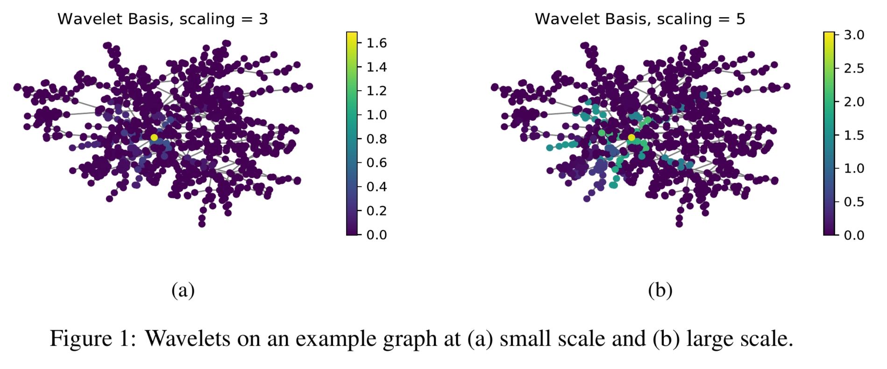
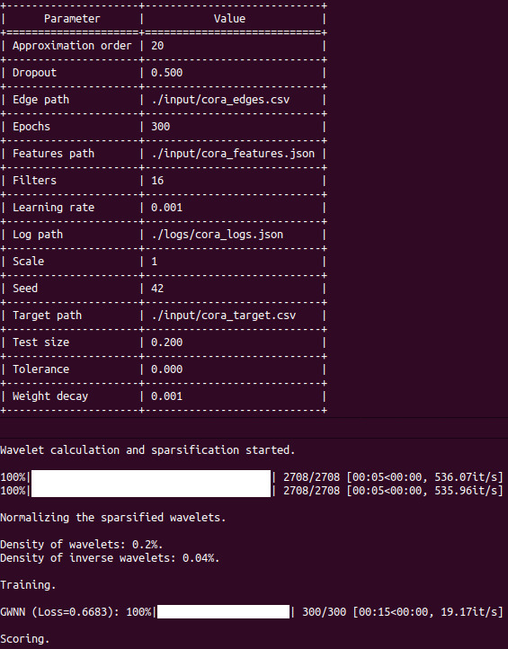

Graph Wavelet Neural Network
============================================

  [](https://arxiv.org/abs/1904.07785) [](https://codebeat.co/projects/github-com-benedekrozemberczki-graphwaveletneuralnetwork-master) [](https://github.com/benedekrozemberczki/GWNN/archive/master.zip)

A PyTorch implementation of **Graph Wavelet Neural Network (ICLR 2019).**
<div style="text-align:center"></div>

### Abstract
<p align="justify">
We present graph wavelet neural network (GWNN), a novel graph convolutional neural network (CNN), leveraging graph wavelet transform to address the shortcomings of previous spectral graph CNN methods that depend on graph Fourier transform. Different from graph Fourier transform, graph wavelet transform can be obtained via a fast algorithm without requiring matrix eigendecomposition with high computational cost. Moreover, graph wavelets are sparse and localized in vertex domain, offering high efficiency and good interpretability for graph convolution. The proposed GWNN significantly outperforms previous spectral graph CNNs in the task of graph-based semi-supervised classification on three benchmark datasets: Cora, Citeseer and Pubmed.</p>

A reference Tensorflow implementation is accessible [[here]](https://github.com/Eilene/GWNN).

This repository provides an implementation of Graph Wavelet Neural Network as described in the paper:

> Graph Wavelet Neural Network.
> Bingbing Xu, Huawei Shen, Qi Cao, Yunqi Qiu, Xueqi Cheng.
> ICLR, 2019.
> [[Paper]](https://openreview.net/forum?id=H1ewdiR5tQ)

### Requirements

The codebase is implemented in Python 3.5.2. package versions used for development are just below.
```
networkx          2.4
tqdm              4.28.1
numpy             1.15.4
pandas            0.23.4
texttable         1.5.0
scipy             1.1.0
argparse          1.1.0
torch             1.1.0
torch-scatter     1.4.0
torch-sparse      0.4.3
torch-cluster     1.4.5
torch-geometric   1.3.2
torchvision       0.3.0
scikit-learn      0.20.0
PyGSP             0.5.1
```
### Datasets
<p align="justify">
The code takes the **edge list** of the graph in a csv file. Every row indicates an edge between two nodes separated by a comma. The first row is a header. Nodes should be indexed starting with 0. A sample graph for `Cora` is included in the  `input/` directory. In addition to the edgelist there is a JSON file with the sparse features and a csv with the target variable.</p>
<p align="justify">
The **feature matrix** is a sparse binary one it is stored as a json. Nodes are keys of the json and feature indices are the values. For each node feature column ids are stored as elements of a list. The feature matrix is structured as:</p>

```javascript
{ 0: [0, 1, 38, 1968, 2000, 52727],
  1: [10000, 20, 3],
  2: [],
  ...
  n: [2018, 10000]}
```
<p align="justify">
The **target vector** is a csv with two columns and headers, the first contains the node identifiers the second the targets. This csv is sorted by node identifiers and the target column contains the class meberships indexed from zero. </p>

| **NODE ID**| **Target** |
| --- | --- |
| 0 | 3 |
| 1 | 1 |
| 2 | 0 |
| 3 | 1 |
| ... | ... |
| n | 3 |

### Options

Training the model is handled by the `src/main.py` script which provides the following command line arguments.

#### Input and output options

```
  --edge-path        STR   Input graph path.   Default is `input/cora_edges.csv`.
  --features-path    STR   Features path.      Default is `input/cora_features.json`.
  --target-path      STR   Target path.        Default is `input/cora_target.csv`.
  --log-path         STR   Log path.           Default is `logs/cora_logs.json`.
```

#### Model options

```
  --epochs                INT       Number of Adam epochs.         Default is 200.
  --learning-rate         FLOAT     Number of training epochs.     Default is 0.01.
  --weight-decay          FLOAT     Weight decay.                  Default is 5*10**-4.
  --filters               INT       Number of filters.             Default is 16.
  --dropout               FLOAT     Dropout probability.           Default is 0.5.
  --test-size             FLOAT     Test set ratio.                Default is 0.2.
  --seed                  INT       Random seeds.                  Default is 42.
  --approximation-order   INT       Chebyshev polynomial order.    Default is 3.
  --tolerance             FLOAT     Wavelet coefficient limit.     Default is 10**-4.
  --scale                 FLOAT     Heat kernel scale.             Default is 1.0.
```

### Examples
<p align="justify">
The following commands learn  the weights of a graph wavelet neural network and saves the logs. The first example trains a graph wavelet neural network on the default dataset with standard hyperparameter settings. Saving the logs at the default path. </p>

```
python src/main.py
```
<p align="center">

</p>

Training a model with more filters in the first layer.

```
python src/main.py --filters 32
```

Approximationg the wavelets with polynomials that have an order of 5.

```
python src/main.py --approximation-order 5
```
